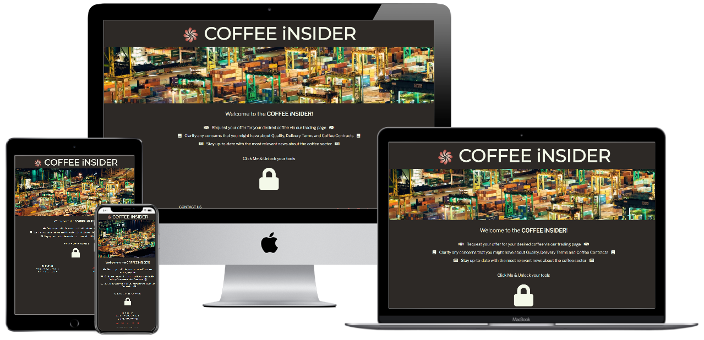
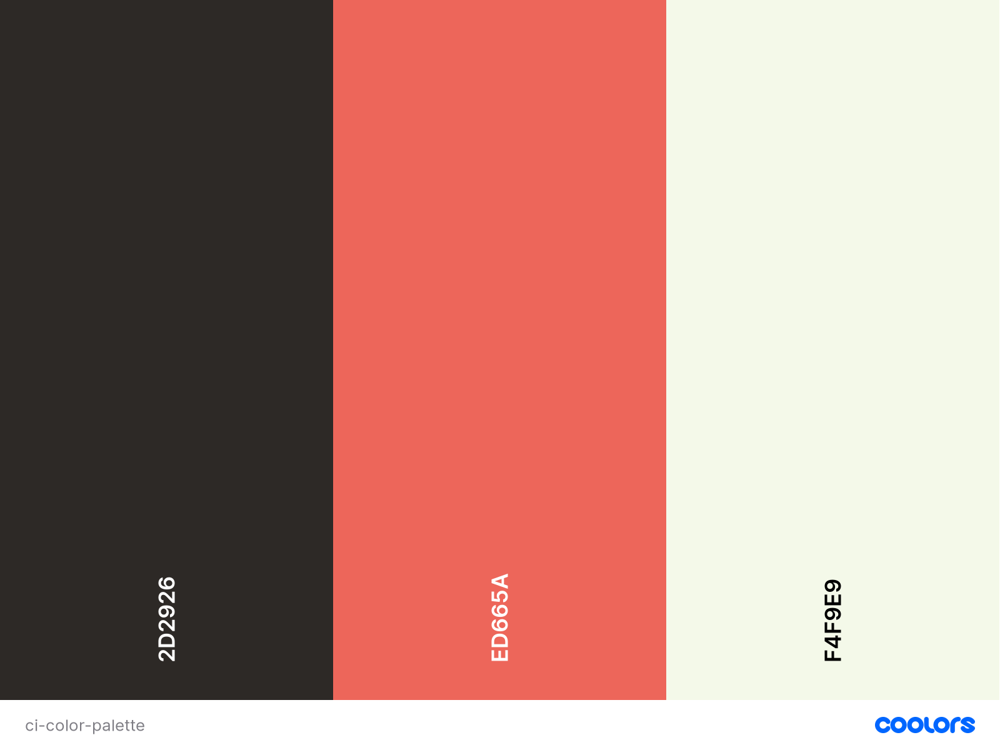

# **Coffee Insider**

---

## **Project Goal** 
The world of coffee might be one of the most complex in the commodites universe. This complexity is not only visable at the farm level, where new coffee varietals are being engineered and planted in order to achieve higher yields and rust-resistant plants, but through the entire supply chain.

Due to this complexity, trying to simplify the commercial and logistic side of any business is crucial in the commodities world. If attainned, it can exponetially strenght relationships and minimize potential future disputes.

Therefore, the main goal of the COFFEE iNSIDER, is to provide the user with an easy accessible and intuitive tool to both suppliers and customers, in order to increase the efficiency of the negotiation process and consequently have parameterized all the components of the logistic process. 

Thank you for visting my project!

---

## **Table of contents**

1. [UX](#ux)

    1.1 [User Goals and Stories](#user-goals-and-stories)

    1.2 [User Requirements and Expectations](#user-requirements-and-expectations)
    
    1.3 [Company Goals](#company-goals)
    
    1.4 [Design Choices](#design-choices)

2. [Wireframes](#wireframes)
 
    2.1 [Changes throughout the coding](#changes-throughout-the-coding)

3. [Features](#features)
 
    3.1 [Existing Features](#existing-features)
 
    3.2 [Future Features](#future-features)

4. [Languages, Libraries, Frameworks and Tools](#languages-libraries-frameworks-and-tools)
 
    4.1 [Languages](#languages)
 
    4.2 [Libraries](#libraries)
 
    4.3 [Frameworks](#frameworks)
 
    4.4 [Tools](#tools)

5. [Testing and Debugging](#testing-and-debugging)
 
    5.1 
 
    5.2
 
    5.3 
 
    5.4 
 
    5.5 

6. [Deployment](#deployment)

7. [Credits and Acknowledgments](#credits-and-acknowledgments)
 
    7.1 [Credits](#credits)
 
    7.2 [Acknowledgments](#acknowledgments)

---

## **UX**

---
[[Back to top]](#table-of-contents)

### **User Goals and Stories**
#### **Goals**
As a user I aim for:
* An intuitive and easy to navigate website.
* Visually attractive pages.
* Concise and accurate information.
* Minimalistic pages without distracting contents.
* Appealing call-to-actions.

#### **Stories**
As a user, I want to:
* Access easily my target page depending on the subject being dicussed with my business relationship.
* Easily consult specific logistics terms.
* Brief unsderstanding of the 2 main the coffee contracts (GCA & ESCC).
* Stay updated with relevant coffee-related news.
* Place an offer request via the website.
* Easily find the company's contacts.
* Easily find the company's social networks.

[[Back to top]](#table-of-contents)

### **User Requirements and Expectations**
#### **Requirements**
* Easy navigation.
* Reliable information.
* Immeadiate feedback on data inputs and/or submissions.
* Good responsiveness across multiple devices and browsers.

#### **Expectations**
* Gracious feedback handling an error.
* Maximum of 1 click to reach any given page in large screen devices and 2 for small and medium devices.
* External links shall open in a new tab.
* Internal links must work properly without breaking.
* External information must be provided by reliable sources.
* Visual effects are appealing but not distracting.
* Appropriate feedback after submitting offer request.

[[Back to top]](#table-of-contents)

### **Company Goals**

* Provide the employees with a tool to aid the negotiation process.
* Give potential and recurring customers an easy way to request an offer.
* Increase the commercial. 
* Provide (mainly) small businesses with limited knowledge about logistics and the coffee sector with the most relevant information in order to conduct their businesses.
* Expand the commercial relationships offering an appealing and informative tool for potential and recurring customers.
* Display the latest news on coffee to both customers and employees.

[[Back to top]](#table-of-contents)

### **Design Choices**
#### Fonts

In order to find the best font pairing to my project, I have used the font pairing generator website [Font Joy](https://fontjoy.com/ "Font Joy")

After running some trials, I have opted out for the below set of fonts to be used throught out the website.

##### Main Headings
[Montserrat](https://fonts.google.com/specimen/Montserrat?query=mont "Google Fonts")

##### Sub-headings/stand-out text
[Lora](https://fonts.google.com/specimen/Lora?query=lora "Google Fonts")

##### Overall content
[Libre Franklin](https://fonts.google.com/specimen/Libre+Franklin "Google Fonts")

In my opinion, these 3 fonts work very well together. From the bold, easy-readable and attractive [Montserrat](https://fonts.google.com/specimen/Montserrat?query=mont "Google Fonts") 
font to be used in the Main Headings, creating an interesting contrast with the [Lora](https://fonts.google.com/specimen/Lora?query=lora "Google Fonts") font in the sub-headings and 
finilizing wth the overall content font, [Libre Frankline](https://fonts.google.com/specimen/Libre+Franklin "Google Fonts"), which embeeds itself very well with the first two. Also,
this font reflects reliability, which is of extreme importance when developing a business website.

#### Icons

Throughout out the website, I will be using icons provided by [FontAwesome](https://fontawesome.com/ "FontAwesome").

The icons uses are self-explanatory and aid the navigation of the user, bringing an intuitive imagery to the website.

#### Colors

Being the main purpose of this website to support B2B relationships in coffee trading, I have selected a simple color palette of 3 colors, each one with a specific meaning in the business world.

* Jet: #2D2926
Whilst some might see black as a pessimistic color, there are several shades that attenuate this feeling, and brings out in the target audience a feeling of confidence, sophistication and comfort.
These feelings are usually consider a plus in any business relationship, reason why I have chosen for the Jet (black) color.

This color is meant to be used as the background-color, displaying a nice contrast with the the Fire Opal or Ivory colors on evry occasion.

* Fire Opal: #ED665A;
The Fire Opal color also gives the feeling to the user of confidence. As it can be considered as an attention-getting color and energizing, I aim to use it as the color for icons, buttons and any special feature that requires attention from the user throughout the website.

* Ivory: #F4F9E9;
The Ivory color bring outs as sense of calmness and relaxation, which is extremely important in every B2B relationship. For this reason, the main texts will have this color applied.

While creating this color scheme, I have resorted to the [Contrast-Checker](https://coolors.co/contrast-checker "Coolors") tool to guarantee a good readability for the user and decide the possible color-pairings to be used in the pages.

|Text color  	|Background color  	|Result   	|
|---	        |---	            |---	    |
|Jet   	        |Fire Opal         	|Good     	|
|Fire Opal   	|Jet               	|Good       |
|Jet   	        |Ivory              |Super     	|
|Ivory          |Jet                |Super      |
|Fire Opal      |Ivory              |Very Poor 	|
|Ivory          |Fire Opal          |Very Poor  |

Therefore, the last 2 pairings are excluded from the design choices.

#### Structure

My website will be divided into 4 different pages:

**Landing Page**
With a B2B relationship in mind, the landing page is aimed to be straight to the point.

Without any nuisance, this page offers exclusively a brief introduction to what is the Coffee Insider and a particular "navigation menu" that will display on a click/hover all the
other relevant pages, represented by intuitive icons.

**Trading Page**
The trading page will offer a tool for companies/customers to request personalized offers for differents coffees that The Coffee Insider can provide.

**News Page**
It is always good to stay up to date, but much better when the news are exclusively about coffee. They simply taste better!

The main goal of this page is to give the user the most recent news about the coffee industry, regardless if he/she is looking to buy coffee or just looking for fresh-brewed 
coffee-related news.

**Glossary Page**
The Glossary page intends to support the user with the 'jargon' used in the coffee sector. 

It will include the relevant terms regarding coffee quality from several coffee producing countries, passing by the Incoterms and finishing with the example of the 2 main base
contracts for coffee [GCA](http://www.greencoffeeassociation.org/images/uploads/resources/PROFESSIONAL_RESOURCES_-_Contract_Terms_Conditions.pdf "Green Coffee Association") & [ESCC](https://www.ecf-coffee.org/wp-content/uploads/2020/09/European-Standard-Contract-for-Coffee-ESCC-2019-edition.pdf "European Standard Contract for Coffee"), which, ***per se***, have a deeper and more technical look onto the coffee sector, despite its limitations.

[[Back to top]](#table-of-contents)

---

## **Wireframes**

[Small devices](wireframes/small-devices.png)

[Medium Devices](wireframes/medium-devices.png)

[Large devices](wireframes/large-devices.png)

### **Changes throughout the coding**

[[Back to top]](#table-of-contents)

---

## **Features**

[[Back to top]](#table-of-contents)

### **Existing Features**

#### ***Navigation, Floating Action Button & Landing Page***

The navigation will be supported in all pages (except the landing page) and devices with a Floating Action Button (FAB) instead of using a common navigation bar on top of the page.

On the landing page, the same button will be displayed at the center, instead of at the right-bottom, and not floating. This is done on purpose in order to attract the attention of the user immeadiately to this button as it will be his/her navigation aid. With this, the intent is to get the user acquainted and engaged from the beginning, and not get lost because there is no navigation bar.

Also, the fact that th user has to click once in order to reveal the 'tools' is intentional as it gives the sense of being in control immeadiately to the user.

This option allows the user to navigate across multiple pages via an intuitive option that accompanies the user through all its navigation and, at the same time, saving some real-estate.

Whilst the button and sub-buttons have been included directly in the HTML files and styling in CSS, I have resorted to jQuery in order to attain the interactiveness and hide/show the sub-buttons linking to the other pages.

The rest of the landing page is self-explanatory, displaying some introductory paragraphs explaining the user what are his/her options, and by the footer the contacts and social links to the Coffee Insider.

#### ***Trading Page***

This page starts with an introductory paragraph, containinig an internal link to the [Glossary] in order to aid the user with the more specific terms that need to be considered at time of business within the coffee sector.

Following, the main part of the trading page consists of an accordion divided into 5 areas:
* Coffee
* Shipping Month
* Incoterms
* Base Contract
* Overview and Offer request

To attain the ***Coffee*** area as initially displayed, I have chosen to start with a only a dropdown select list. This list is being populated through jQuery via the own created 'coffees.json' file.

After the user selects his/her first coffee, it triggers an onChange function which will append 2 new fields to the trading.html. At this point, the user will intuitively understand that he will have to fill in the amount of bags for the selected coffee. As this field is a required field, and won't pass the form validation at a later stage, the placeholder contains an asterisk, which is commonly recognized as the sign for a required field.

After his/her first selection, the user can opt for add an extra coffee or proceed to the next are inside the accordion. If he/she decides to add a new coffee by clicking the '+ Add Coffee' button, it will trigger an onClick function that will append a the dropdown select list mentioned above, and the same process starts again.

In order to preserve a good UX, I have limited the amount of new inserted dropdown lists to 10, which can be considered, considering my experiecne within the coffee trading sector, as being on the high side of the amount of coffees someone might be interested in one purchase.

The only difference between the first dropdown select list and the remaining ones is that these latter are accompanied by a 'trash' icon. This button when appended bring alongside with it an onClick function, that will remove the parent div from the equation.

I have chosen to display it this way because, in order for someone to request an offer, it will always be necessary to have selected one type of coffee, giving the remove option only to the following one.

The following step of the Order Request process is to select the ***Shipping Month***. By clicking on it, the previous ***Coffee*** area collapses and this option shows.

In order to give the user the best experience possible, the shipping month selection has been implemented giving the user the option to select a given month within a one year period from the current date.

To accomplish this, I have adapted the code shared by the user 'skelly' on [Codeply](https://www.codeply.com/go/fVMtEP6yNw/javascript-loop-date-months "Codeply").

After selecting this option, the user can follow for the next step, ***Incoterms***. Once again, the previous area of the accordion is collapsed and the new onw shows.

Within this area of the accordion, given the high specificity of the terms used, the user has the option of opening the official link of the [Incoterms](https://iccwbo.org/resources-for-business/incoterms-rules/incoterms-2020/ "Incoterms") to support him/her if the [Glossary] page was not enough.

If all is clear, the user can pick one delivery term out of the 11 available. To attain this options, I have created a JSON file 'incoterms.json' with all the necessary information for the [Glossary] out of which I loop through all the entries and retreive the needed abbreviation, appending it as a button.

Following to the next step, ***Base Contract***, the user is shown only 2 options, representative of the most common contracts that rule coffee business transactions. As these are only two, they were added directly in the trading.html.

The final step of the Order Request, is merely a contact form where the user will input his/her data to be used on the ***Overview***, where all the fields are required.

To access the ***Overview***, the user will click the "Check my Overview" button, opening a modal displaying all the inputs passed on by the user throughout the accordion.

If the user failed to input the 'Select your Coffee' and/or the 'Amount', a Warning modal will pop-up guiding the user to the first step. If contact form fields are not filled the embeeded tootips from Bootstrap for the effect will jump out.

On the contrary, if all is in order, the user has the ability to review his request, and at a click of a button request a personalized offer by clicking the 'Request Offer' button. When this happens, an email is sent via emailJS to my personal email, triggering a confirmation modal and reseting the accordion completely.

#### ***Glossary Page***

The ***Glossary Page*** is intended to give the user support for the most complex terms of the trading process.

In order to accomplish this goal, the info displayed about ***Coffees*** and the ***Incoterms*** have its source on the respective JSON files, compiled by me. To display this info, I have looped over the files and retreived the necessary information, appending the information via jQuery in the respective IDs.

Regarding the ***Base COntracts***, these have been added directly to the glossary.html via an href, giving the user access to the most updated contracts in pdf format.

#### ***News Page***

The ***News Page*** is a simple and eye-catching page that retreives from the external API from The New York Times, all relevant news regarding coffee.

The concept is the same as the one used to retreive data from the JSON files, but in this case, being an external API, the loading time is higher than the other data gathering.

For this reason, I have implemented a Loading Spinner, to pass the feeling of the machine being working for the user and not the user waiting for the machine, improving the UX.

#### ***Footer/Contacts***
The footer includes the points of contact with the company, devided into direct contacts and social links, the later represented solely by its representative icons from
[FontAwesome](https://fontawesome.com/ "FontAwesome").

With these 4 pages, I have attainned the following features:

* Use of external API from [The NY Times](https://developer.nytimes.com/docs/articlesearch-product/1/overview "The New York Times").
* Use of [emailJS](https://www.emailjs.com/docs/ "emailJS")
* Form validation
* Immeadiate feedback to user

[[Back to top]](#table-of-contents)

### **Future Features**

[[Back to top]](#table-of-contents)

---

## **Languages, Libraries, Frameworks and Tools**

[[Back to top]](#table-of-contents)

### **Languages**
* [HTML](https://www.w3.org/MarkUp/1995-archive/html-spec.html "HTML")
* [CSS](https://www.w3.org/Style/CSS/Overview.en.html "CSS")
* [Javascript](https://developer.mozilla.org/en-US/docs/Web/JavaScript "Javascript")

[[Back to top]](#table-of-contents)

### **Libraries**
* [jQuery](https://jquery.com/ "jQuery")
* [FontAwesome](https://fontawesome.com/ "FontAwesome")
* [Google Fonts](https://fonts.google.com/ "Google Fonts")
* [Unsplash](https://unsplash.com/ "Unsplash")

[[Back to top]](#table-of-contents)

### **Frameworks**
* [Bootstrap](https://getbootstrap.com/ "Bootstrap")

[[Back to top]](#table-of-contents)

### **Tools**
* [Git](https://git-scm.com/ "Git")
* [Gitpod](https://gitpod.io/ "Gitpod")
* [Balsamiq](https://balsamiq.com/ "Balsamiq")
* [Font Joy](https://fontjoy.com/ "Font Joy")
* [Coolors](https://coolors.co/ "Coolors")
* [Contrast-Checker](https://coolors.co/contrast-checker "Contrast Checker")
* [Free Logo Design](https://www.freelogodesign.org "Free Logo Design")
* [TinyPNG](https://tinypng.com/ "Tiny PNG")
* [ConvertCSV](https://www.convertcsv.com/csv-to-json.htm "ConvertCSV")
* [Favicon](https://favicon.io/favicon-converter/ "Favcicon")
* [Techsini](http://techsini.com/multi-mockup/ "Techsini")
* [W3C-Markup-validation](https://validator.w3.org/ "Markup Validator")
* [W3C-Jigsaw](https://jigsaw.w3.org/css-validator/ "Jigsaw Validator")
* [W3C-Spell Checker](https://www.w3.org/2002/01/spellchecker "Spell Checker")
* [Google-Lightouse](https://developers.google.com/web/tools/lighthouse "Google Lighthouse") 

[[Back to top]](#table-of-contents)

---

[[Back to top]](#table-of-contents)

## **Testing and Debugging**

[[Back to top]](#table-of-contents)

### **Test 1: Responsiveness**

#### **User Stories and Requirements** ####
* Good responsiveness across multiple devices and browsers.

##### **UX** #####
The user is able to access the webiste through multiple devices without issues.

##### **Execution** #####
To tackle this need, I have used Bootstrap across all the pages, the reason why I am confident that the responsiveness of the entire website is very good.

##### **Testing** #####
To test the responsiveness, I have navigated through the website in multiple devices (iPhone 8, iPhone SE, Acer Spin and MacBook Air) and browsers (Chrome, Safari, Firefox, Edge and Opera Touch).

Also, family and friends have tested the website in their own devices.

##### **Test result** #####
Responsiveness is working properly across multiple browsers and devices and no responsiveness issue has been reported.

##### **Conclusion** #####
The test passes all the criteria

### **Test 2: Navigation**

#### **User Stories and Requirements** ####

* Access easily my target page depending on the subject being dicussed with my business relationship.
* Easily find the company's contacts.
* Easily find the company's social networks.
* Easy navigation.

##### **UX** #####
When user lands on the website, the attention is immeadiately brought to the padlock.

The functionaility of the padlock gives the feeling to the user that he/she is in control.

Also, the user can easily reach any given page on max two clicks, maximizing the UX. 

The user can easily find all the contacts and social networks as they are placed at the footer of every page.

##### **Execution** #####
The padlock on the landing page is especially placed in the center so the user understands, as of the moment it uses it for the first time, that it is the core of the navigation.

On the other pages, the padlock converts into a Floating Action Button, and is placed on the bottom right, being easily recognized by the user, not generating the feeling of being lost.

The contacts and social links are placed as per convention on footer of the page, opening in new tabs.

##### **Testing** #####
Even though some might argue that in the landing page there is 1 unecessary click in order to access the padlock sub-buttons, this not only creates a sense of control to the user but also helps the user to engage better with the website.

Also, if this was to be an issue, it would only be visable in large screens as it is standard for medium and small devices to use an 'hamburguer' menu to display the navigation bar.

##### **Test result** #####
Navigation is simply and intuitive and gives the user the constant feeling that he/she is in control.

User can easily access every page at a distance of 2 clicks and contacts and social networks are well visible in every page.

##### **Conclusion** #####
The test passes all the criteria.

### **Test 2: Glossary**

#### **User Stories and Requirements** ####
* Easily consult specific logistics terms.
* Brief unsderstanding of the 2 main the coffee contracts (GCA & ESCC).
* Reliable information.

##### **UX** #####
When the user enters the ***Glossary*** page he/she automatically perceives that it is the place to clarify any doubts in the website. The hero image plays an important role generating this feeling.

The user is shown 3 different topics that he might want to address. 

##### **Execution** #####
As a merely informative page, the interactivity with the user is limited, only being smoothen by the dynamics of the grouped coffees.

The first topic are the coffee types grouped by country of origin, followed by an extensive list of the Incoterms and corresponding information, finalizing with the two Base Contracts and corresponding access in pdf format.

##### **Testing** #####
Careful verification of all the content, if all the info was being pushed correctly and that the cards are being displayed correctly.

All internal and external links are funtioning properly.

##### **Test result** #####
Even though some additional styling can be put in place, the page fully covers its intent and tackles the user stories and requirements.

##### **Conclusion** #####
The test passes all the criteria.

### **Test 3: News**

#### **User Stories and Requirements** ####
* Stay updated with relevant coffee-related news.

##### **UX** #####
Intuitively, the user understands what to do in the page: Either read only the article brief or, if a deeper read is wanted, click in the desired article button to check the full article.

##### **Execution** #####
When the user enters the ***News*** page he/she is automatically confrontated with the loading spinner, which works as an immeadiate feedback to the user.

After articles are retreived from The New York Times API, these are displayed in cards, transmitting the sense of being reading an actual newspaper.

On top of this, the articles displayed are ordered from the most recent to oldest, thus always showing the most recent news first avoding the user to have to scroll-down to stay updated.

If, for instance, the articles can not be retreived, an error message shows on the page, requesting the user to try again.

##### **Testing** #####
Assured that the 'Check this Article' button opens in a new tab and redirects the user to the correct article.

By changing the API key in the correspondent JS file, I was able to test the error message.

##### **Test result** #####
Articles are being displayed as wanted, loading spinner works as intended and error message is nicely showcased when necessary.

##### **Conclusion** #####
The test passes all the criteria.

### **Test 4: Offer Request**

#### **User Stories and Requirements** ####
* Place an offer request via the website.
* Immeadiate feedback on data inputs and/or submissions.

##### **UX** #####
When the user enters the ***Trading*** page, he/she is welcomed by a well-defined data gathering process, ultimately being sent to the Company vie emaiJS, receiving immeadiate feedback on critical points of the offer request, as well as connection links to relevant pages, including the glossary, in case any doubt arises. 

##### **Execution** #####
The execution of this step has been already presented in [Trading Page]()

##### **Testing** #####
I have gone through all the offer request steps several times, tackling immeadiately bugs that were being found, including the form validation.

##### **Test result** #####
Select coffees dropdown list is being correctly populated.
Add and remove buttons are working properly in the coffee selection.
Select buttons from remaining sections and working correctly.
Overview, Warning and Error modals are correctly validating form inputs, being properly displayed and showing correct information.
emailJS is correctly sending the overview to the company email.

##### **Conclusion** #####
The test passes all the criteria.

[[Back to top]](#table-of-contents)

### **Debugging**
#### **Known Bugs and Corrections** ####

##### **Bug** #####
When selecting the amount to coffee bags desired, the input field was allowing negative numbers.
##### **(Potential) Corrections** #####
Firstly, I have added the 'min="0"' as an attribute of the input field, only to come to the realization that this was not the way to go, as user does not submit any form when moving to the next step, thus not validating the input attribute.

Therefore, I have created a an "external" validation in Javascript on the moment the user submits the form on the last step.

<!-- ##### **Bug** #####
calc.html -> Quantity Input field allows decimal numbers
##### **(Potential) Corrections** #####
Added 'min="0"' as an attribute of the input element. -->

##### **Bug** #####
calc.html -> anchor tag oc incoterms does not allow spacing before and after.
##### **(Potential) Corrections** #####
Unfixed at the moment

##### **Bug** #####
Access to XMLHttpRequest at 'https://futures.tradingcharts.com/futures/quotes/kc.html?cbase=kc' from origin 'https://8000-e4e47aac-b552-443c-afb5-41a2746ebb9d.ws-eu03.gitpod.io' has been blocked by CORS policy: No 'Access-Control-Allow-Origin' header is present on the requested resource.
##### **(Potential) Corrections** #####
Not possible use the load method form jQuery to present the external website info on calc.html.

Therefore, I started implementing this feature with an <iframe> instead.

Nonethless, this option also retreives the following error originated externally:

    Uncaught TypeError: Cannot read property 'querySelector' of undefined
    at getElement (tradingcharts-emailsignup.js:265)
    at tradingcharts-emailsignup.js:34
 
 Additional research [MDN](https://developer.mozilla.org/en-US/docs/Learn/HTML/Multimedia_and_embedding/Other_embedding_technologies "MDN") raises other several concerns with this option.

As this goes far beyond my current skills, I have opt out to include it in future releases.

##### **Bug** #####
On click function:
    $('.incoterms').click(function(){
            while(selectedIncoterm.length>0){
                selectedIncoterm.pop();
            }
    });
    $('.incoterms').removeClass("selected-choice");
        $(this).addClass("selected-choice");
        selectedIncoterm.push($(this).val()
    );

 is not pushing value to selectedIncoterm variable

##### **(Potential) Corrections** #####
    $('.incoterms').click(function(){
            while(selectedIncoterm.length>0){
                selectedIncoterm.pop();
            }
        $('.incoterms').removeClass("selected-choice");
        $(this).addClass("selected-choice");
        selectedIncoterm.push($(this).val());
    });

##### **Bug** #####
EmailJS receives overview content in a single line.
##### **(Potential) Corrections** #####
"overview": offerRequest.selectedCoffeesBulk.value.replace(/\n/g, " "),

##### **Bug** #####
When several coffees are selected, and the user decides that he/she no longer wants the first option, he/she can not deleted.
##### **(Potential) Corrections** #####
For the time being, the user will have to move his last choice to the first, and delete the last appended option. This might be of a slight inconvenience for the user, the reason why I will implement in future releases a delete button that will only be displayed if more coffees have been selected, bring the other options up in the div.

##### **Bug** #####
Overlay
##### **(Potential) Corrections** #####

[[Back to top]](#table-of-contents)

---

## **Deployment**

The Coffee Insider project has been deployed via GitHub after its final push.

These are the deployment steps:

1 - Go to settings within the corresponding repository in GitHub
2 - Scroll down to GitHub Pages section
3 - Choose the correspondent master branch and click save
The page is now live on https://arturmpinho.github.io/coffeeinsider/

The page updates automatically after commit and push to Github any potential change.

To run the project locally:

1 - Click the green Gitpod/Clone button or Download button on the Github Repository.
2 - Copy the link shown in the Using the Clone with HTTPS option.
3 - Open your IDE and Git Terminal.
4 - Change the workspace directory to the location where you want to clone the Repository.
5 - Input "git clone" followed by pasting the copied link.

[[Back to top]](#table-of-contents)

---

## **Credits and Acknowledgments**

[[Back to top]](#table-of-contents)

### **Credits**
* [MDN WebDocs](https://developer.mozilla.org/ "MDN WebDocs")
#### **Media**
#### **Content**
* [Incoterms 2020](https://iccwbo.org/resources-for-business/incoterms-rules/incoterms-2020/ "Incoterms")
##### **JSON files**

coffee.json: www.supremo.be and http://www.ico.org/projects/Good-Hygiene-Practices/cnt/cnt_en/sec_3/docs_3.3/Grading%20&%20class.pdf

[[Back to top]](#table-of-contents)

### **Acknowledgments**

[[Back to top]](#table-of-contents)