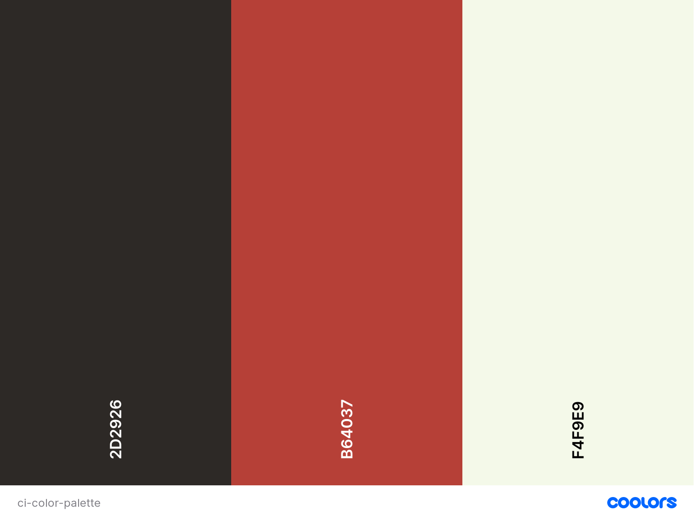

# **Coffee Insider**

---

## **Project Goal** 
The world of coffee might be one of the most complex in the commodites universe. This complexity is not only visable at the farm level, where new coffee varietals are being engineered
and planted in order to achieve higher yields and rust-resistant plants, but through the entire supply chain.

Due to this complexity, trying to simplify the commercial and logistic side of any business is crucial in the commodities world. If attainned, it can exponetially strenght relationships 
and minimize potential future disputes.

Therefore, the main goal of the COFFEE iNSIDER, is to provide the user with an easy accessible and intuitive tool to both suppliers and customers, in order to increase the efficiency 
of the negotiation process and consequently have parameterized all the components of the logistic process. 

Thank you for visting my project!

---

## **Table of contents**

1. [UX](#ux)

    1.1 [User Goals and Stories](#user-goals-and-stories)

    1.2 [User Requirements and Expectations](#user-requirements-and-expectations)
    
    1.3 [Company Goals](#company-goals)
    
    1.4 [Design Choices](#design-choices)

2. [Wireframes](#wireframes)
 
    2.1 [Changes throughout the coding](#changes-throughout-the-coding)

3. [Features](#features)
 
    3.1 [Existing Features](#existing-features)
 
    3.2 [Future Features](#future-features)

4. [Languages, Libraries, Frameworks and Tools](#languages-libraries-frameworks-and-tools)
 
    4.1 [Languages](#languages)
 
    4.2 [Libraries](#libraries)
 
    4.3 [Frameworks](#frameworks)
 
    4.4 [Tools](#tools)

5. [Testing and Debugging](#testing-and-debugging)
 
    5.1 
 
    5.2
 
    5.3 
 
    5.4 
 
    5.5 

6. [Deployment](#deployment)

7. [Credits and Acknowledgments](#credits-and-acknowledgments)
 
    7.1 [Credits](#credits)
 
    7.2 [Acknowledgments](#acknowledgments)

---

## **UX**

---
[[Back to top]](#table-of-contents)

### **User Goals and Stories**
#### **Goals**
As a user I aim for:
* An intuitive and easy to navigate website.
* Visually attractive pages.
* Concise and accurate information.
* Minimalistic pages without distracting contents.
* Appealing call-to-actions.

#### **Stories**
As a user, I want to:
* Access easily my target page depending on the subject being dicussed with my business relationship.
* Calculate the approximate transit time of my coffee.
* Easily convert common units used across the coffee businesses worldwide (i.e bags of 70Kg to pounds, USc/Lb to USD/Kg, etc).
* Have the total price of coffee in my local currency.
* Have an overview of macroeconomic indicators of countries I am doing business with.
* Place and order request via the website.
* Easily find the company's contacts.
* Easily find the company's social networks.

[[Back to top]](#table-of-contents)

### **User Requirements and Expectations**
#### **Requirements**
* Easy navigation.
* Reliable information.
* Clear graphics.
* Immeadiate feedback on data inputs and/or submissions.
* Accurate unit conversions.
* Good responsiveness across multiple devices.

#### **Expectations**
* Gracious feedback handling an error.
* Maximum of 2 clicks to reach any given page.
* External links shall open in a new tab.
* Internal links must work properly.
* External information must be provided by reliable sources.
* Visual effects are appealing but not distracting.
* Approprite feedback after submitting offer request.

[[Back to top]](#table-of-contents)

### **Company Goals**

* Provide the employees with a tool to aid the negotiation process.
* Give potential customers an easy way to request an offer.
* Access relevant information of potential customers country.
* Display accurate route and transit times between ports of origin and destination.
* Show relevant economic and coffee related news.

[[Back to top]](#table-of-contents)

### **Design Choices**
#### Fonts

In order to find the best font pairing to my project, I have used the font pairing generator website [Font Joy](https://fontjoy.com/ "Font Joy")

After running some trials, I have opted out for the below set of fonts to be used throught out the website.

##### Main Headings
[Montserrat](https://fonts.google.com/specimen/Montserrat?query=mont "Google Fonts")

##### Sub-headings/stand-out text
[Lora](https://fonts.google.com/specimen/Lora?query=lora "Google Fonts")

##### Overall content
[Libre Frankline](https://fonts.google.com/specimen/Libre+Franklin "Google Fonts")

In my opinion, these 3 fonts work very well together. From the bold, easy-readable and attractive [Montserrat](https://fonts.google.com/specimen/Montserrat?query=mont "Google Fonts") 
font to be used in the Main Headings, creating an interesting contrast with the [Lora](https://fonts.google.com/specimen/Lora?query=lora "Google Fonts") font in the sub-headings and 
finilizing wth the overall content font, [Libre Frankline](https://fonts.google.com/specimen/Libre+Franklin "Google Fonts"), which embeeds itself very well with the first two. Also,
this font reflects reliability, which is of extreme importance when developing a business website.

#### Icons

Throuhg out the website, I will be using icons provided by [FontAwesome](https://fontawesome.com/ "FontAwesome").

The icons uses are self-explanatory and aid the navigation of the user by bringing an intuitive imagery to the website.

#### Colors

Being the main purpose of this website to support B2B relationships in coffee trading, I have selected a simple color palette of 3 colors, each one with a specific meaning in the business world.

* Jet: #2D2926
Whilst some might see black as a pessimistic color, there are several shades that attenuate this feeling, and bring out in the target audience a feling of confidence, sophistication and comfort.
These feelings are usually consider a plus in any business relationship, reason why I have chosen for the Jet (black) color.

This color is meant to be used as the main text-color, or in specific parts of the website as a backgroun-color, in contrast with the the Fire Opal or Ivory colors.

* Fire Opal: #ED665A;
The Fire Opal color also gives the feeling to the user of confidence. As it can be considered as an attention-getting color and energizing, I aim to use it as the color for icons and buttons throughout 
the website.

* Ivory: #F4F9E9;
In contrast with the previous colors, the Ivory bring outs as sense of calmness and relaxation, which is extremely important in every B2B relationship.

While creating this color scheme, I have resorted to the [Contrast-Checker](https://coolors.co/contrast-checker) tool to guarantee a good readability for the user and decide the possible color-pairings
possible to be used throuought the page.

|Text color  	|Background color  	|Result   	|
|---	        |---	            |---	    |
|Jet   	        |Fire Opal         	|Good     	|
|Fire Opal   	|Jet               	|Good       |
|Jet   	        |Ivory              |Super     	|
|Ivory          |Jet                |Super      |
|Fire Opal      |Ivory              |Very Poor 	|
|Ivory          |Fire Opal          |Very Poor  |

Therefore, the last 2 pairings are excluded from the design choices.

#### Structure

[[Back to top]](#table-of-contents)

---

## **Wireframes**

[Small devices](wireframes/small-devices.png)

[Medium Devices](wireframes/medium-devices.png)

[Large devices](wireframes/large-devices.png)

### **Changes throughout the coding**

[[Back to top]](#table-of-contents)

---

## **Features**

[[Back to top]](#table-of-contents)

### **Existing Features**

#### ***Navigation: Floating Action Button***

The navigation will be supported in all devices with a Floating Action Button (FAB) instead of using a navigation bar.

This option allows the user to navigate across multiple pages via an intuitive option that accompanies the user through all its navigation and, at the same time, saves some real-estate.

#### ***Landing Page***

The landing page merely displays the title of the website with a small introductory paragraph. 

This is followed by a giant centered radial FAB, that includes a menu with internal links to the other pages, each one with a representative icon.

On the bottom of the page, a footer is displayed with the company contacts and social links.

#### ***Route overview***

The route overview page gives the user the option to choose out of a dropdown list box the port of origin and the port of destination.

Automatically, a preview of the route will be displayed in a map, followed by the information of the estimate transit time.

The FAB is present at the bottom right of the page.

#### ***Offer request & Unit conversion***

This section of the webpage will be divided into 3 parts.

First, the user will be confrontated with an accordion that will have included a form to request a personalized offer for the coffe he/she is looking for.

Secondly, as the previous last section of the accordion, the user will have the option to choose the units he/she wants to be working with, including weight and currency, as well
as inputing his/her price idea and immeadiately receive the conversions.

Thirdly, right after submitting the form, a module will pop-up confirming that the offer request has been sent, with an overview of the request. At the same moment, a confirmation 
email will be sent to the user and a request email to the company.

#### ***Footer/Contacts***
The footer will include the points of contact with the company, devided into direct contacts and social links, the later represented solely by its representative icon from
[FontAwesome](https://fontawesome.com/ "FontAwesome").

#### ***Modal***
The modal implemented when summiting the form, is one of the best ways to issue immeadiate feedback to the user. This addresses this user need and at the same times gives the user
the sense of being under control of his/her actions.

[[Back to top]](#table-of-contents)

### **Future Features**

[[Back to top]](#table-of-contents)

---

## **Languages, Libraries, Frameworks and Tools**

[[Back to top]](#table-of-contents)

### **Languages**
* [HTML](https://www.w3.org/MarkUp/1995-archive/html-spec.html "HTML")
* [CSS](https://www.w3.org/Style/CSS/Overview.en.html "CSS")
* [Javascript](https://developer.mozilla.org/en-US/docs/Web/JavaScript "Javascript")

[[Back to top]](#table-of-contents)

### **Libraries**
* [FontAwesome](https://fontawesome.com/ "FontAwesome")
* [Google Fonts](https://fonts.google.com/ "Google Fonts")
* [Unsplash](https://unsplash.com/ "Unsplash")

[[Back to top]](#table-of-contents)

### **Frameworks**
* [Bootstrap](https://getbootstrap.com/ "Bootstrap")

[[Back to top]](#table-of-contents)

### **Tools**
* [Git](https://git-scm.com/ "Git")
* [Gitpod](https://gitpod.io/ "Gitpod")
* [Balsamiq](https://balsamiq.com/ "Balsamiq")
* [Font Joy](https://fontjoy.com/ "Font Joy")
* [Coolors](https://coolors.co/ "Coolors")
* [Contrast-Checker](https://coolors.co/contrast-checker "Contrast Checker")
* [TinyPNG](https://tinypng.com/ "Tiny PNG")
* [Favicon](https://favicon.io/favicon-converter/ "Favcicon")
* [Techsini](http://techsini.com/multi-mockup/ "Techsini")
* [W3C-Markup-validation](https://validator.w3.org/ "Markup Validator")
* [W3C-Jigsaw](https://jigsaw.w3.org/css-validator/ "Jigsaw Validator")
* [W3C-Spell Checker](https://www.w3.org/2002/01/spellchecker "Spell Checker")
* [Google-Lightouse](https://developers.google.com/web/tools/lighthouse "Google Lighthouse") 

[[Back to top]](#table-of-contents)

---

[[Back to top]](#table-of-contents)

## **Testing and Debugging**

[[Back to top]](#table-of-contents)

### **Test 1: Responsiveness**

#### **User Stories and Requirements** ####

##### **UX** #####

##### **Execution** #####

##### **Testing** #####

##### **Test result** #####

##### **Conclusion** #####

[[Back to top]](#table-of-contents)

### **Debugging**
#### **Known Bugs and Corrections** ####

##### **Bug** #####
##### **(Potential) Corrections** #####

[[Back to top]](#table-of-contents)

---

## **Deployment**

[[Back to top]](#table-of-contents)

---

## **Credits and Acknowledgments**

[[Back to top]](#table-of-contents)

### **Credits**
#### **Media**
#### **Content**

[[Back to top]](#table-of-contents)

### **Acknowledgments**

[[Back to top]](#table-of-contents)